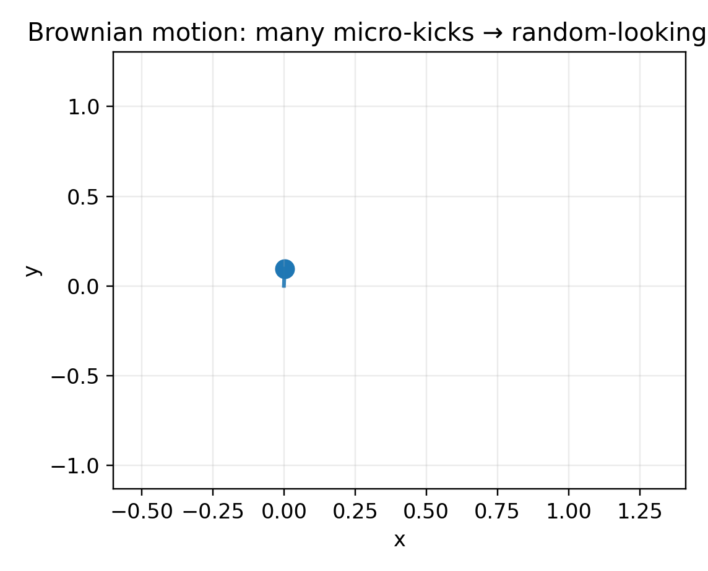
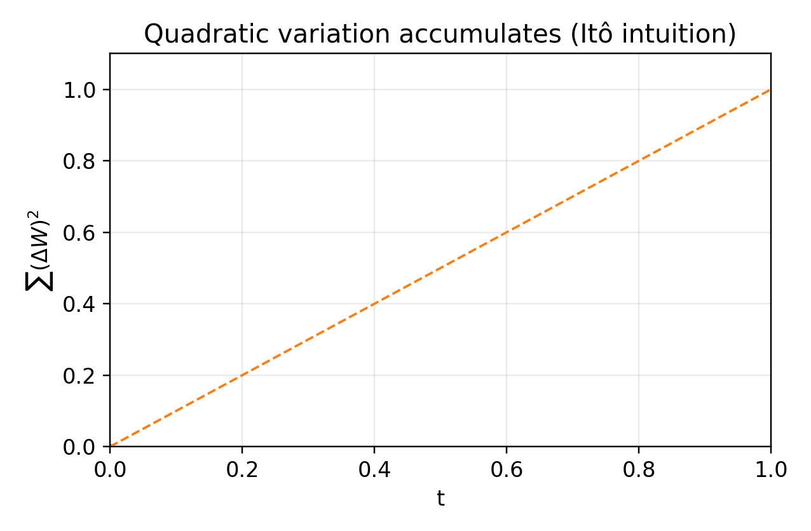
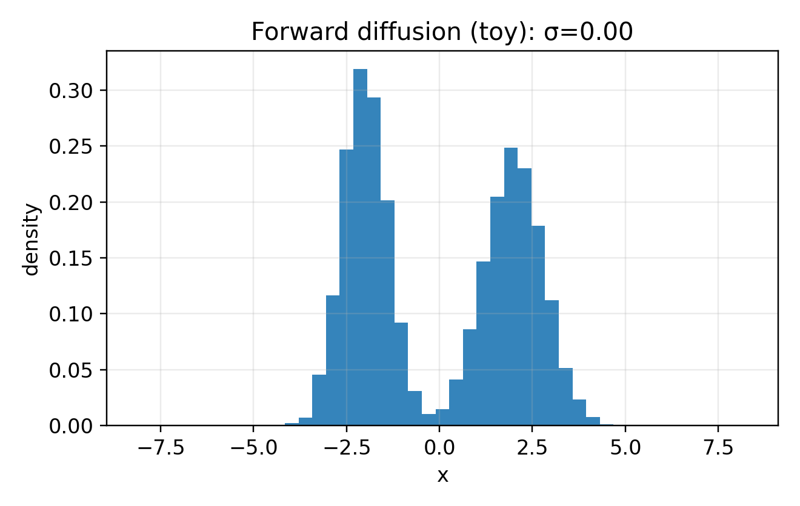

# Доклад «Стохастическое моделирование» (акцент на SDE)

Небольшой репозиторий с Beamer-презентацией (LuaLaTeX) и скриптами, которые **воспроизводимо генерируют** все картинки/анимации для доклада по теме **стохастического моделирования** с фокусом на **стохастических дифференциальных уравнениях (SDE)**.

**Автор:** Дмитрий Ластовецкий  
**Курс:** методы математического моделирования (ИТМО)  
**Преподаватель:** Кочевадов Виталий Алексеевич, доцент ИМ

> ⚠️ PDF-анимации (`animate`) часто **не проигрываются в браузере (Chrome/Safari)**. Для просмотра анимаций используйте **Adobe Acrobat Reader**.

---

## Содержание доклада (кратко)

1. **История и интуиция**
   - Броуновское движение как физический механизм
   - Винеровский процесс как математическая модель шума
   - Ключевая идея Ито: почему появляется «лишний» член и почему $(dW_t)^2 \sim dt$

2. **SDE как модель**
   - Формула: $dX_t = a(X_t,t)\,dt + b(X_t,t)\,dW_t$
   - Интерпретация drift/diffusion, чем SDE отличается от ODE

3. **Кейсы**
   - Финансы: **GBM / Black–Scholes** (веер траекторий, риск как распределение $S_T$)
   - ML: **forward diffusion** (добавление шума) и интуиция reverse/score

4. **Как считают на практике**
   - Симуляция, дискретизация, Euler–Maruyama
   - Почему шаг $\Delta t$ важен и что именно ломается при грубой сетке

---

## Примеры анимаций (GIF-превью)

> GIF нужны для превью/README. В PDF анимации идут через `\animategraphics` и лучше всего работают в Acrobat Reader.

| Что показывает | Превью |
|---|---|
| Броуновская частица (траектория во времени) |  |
| Винеровский процесс $W_t$ (несколько траекторий) |  |
| Квадратичная вариация $\sum (\Delta W)^2 \to T$ (интуиция Ито) |  |
| Black–Scholes/GBM «веер» траекторий |  |
| Forward diffusion в 1D (распределение «упрощается» при росте $\sigma$) |  |

---

## Структура репозитория

```text
.
├── main.tex
├── figs/
│   └── (статичные картинки)
├── figs/history/
│   ├── *_anim/           # кадры frame_*.png для PDF-анимаций
│   └── *.gif             # GIF-превью (опционально)
└── scripts/
    ├── make_history_figs.py
    └── make_gif.py
````

---

## Как собрать

### 1) Python-зависимости

```bash
pip install -U numpy matplotlib pillow imageio
```

### 2) Сгенерировать картинки и кадры

```bash
python scripts/make_history_figs.py --frames 200
```

### 3) (Опционально) собрать GIF из кадров

```bash
python scripts/make_gif.py --fps 20
```

### 4) Собрать PDF (LuaLaTeX)

```bash
latexmk -pdf -lualatex -interaction=nonstopmode -halt-on-error main.tex
```

Очистка артефактов:

```bash
latexmk -C
```

---

## Частые проблемы

* **Анимация не работает в Chrome** — это нормально, используйте **Adobe Acrobat Reader**.

---
